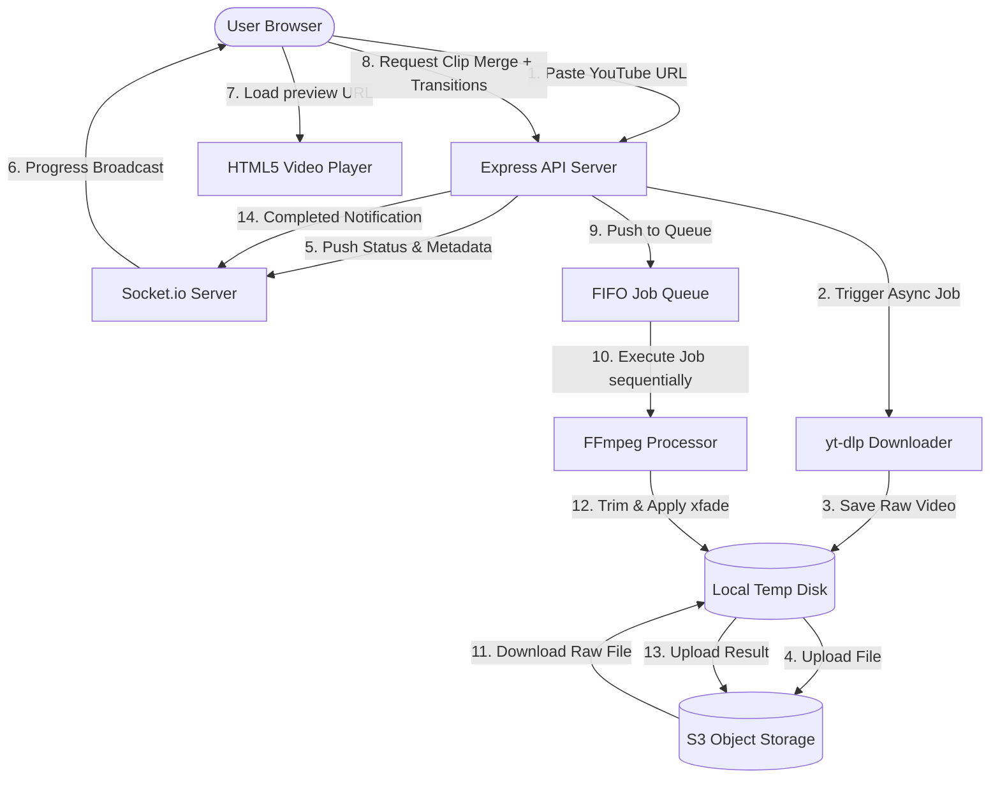
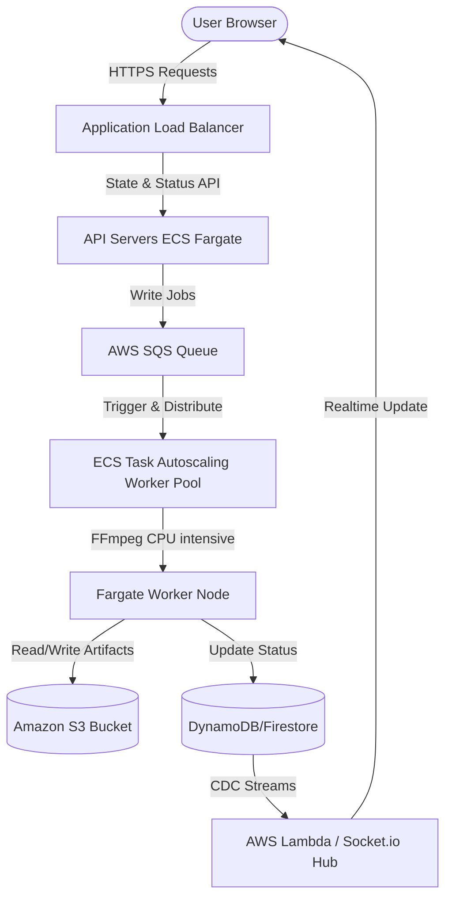

# Base Project - Video Editor Mini App

Reusable full-stack starter template customized into a **Video Editor Mini App** that downloads, slices, and merges segments of YouTube videos with transition effects.

## Structure

```
base-project/
├── front-end/          # Next.js 16 + React 19 + Tailwind v4
├── back-end/           # Express + TypeScript + Firebase + Socket.io
├── instructions/       # Architecture conventions
└── design.md           # Product design reference
```

## Quick Start

### Backend

#### Option A — Local development

```bash
cd back-end
cp .env.example .env
# Fill in Firebase credentials & AWS credentials for LocalStack S3
npm install
npm run dev
```

#### Option B — Docker (API + LocalStack S3 + Postgres)

Runs the production build inside a container with **0.5 vCPU / 1 GB RAM** limits (matching AWS ECS Fargate constraints). LocalStack provides S3 at `http://localhost:4599`.

```bash
cd back-end
cp .env.example .env
# Fill in Firebase credentials (AWS vars are overridden by docker-compose for LocalStack)
docker compose up --build
```

| Service | URL |
|---------|-----|
| API | `http://localhost:5000` |
| LocalStack S3 | `http://localhost:4599` |
| Postgres | `localhost:5439` |

Health check: `GET /api/health`.

### Frontend

```bash
cd front-end
cp .env.example .env.local
npm install
npm run dev
```

App runs at `http://localhost:3000`. Default route redirects to `/dashboard`.

---

## 🎬 Video Editor Architecture & Design Decisions

This solution implements a robust pipeline for downloading, slicing, and merging YouTube video segments, designed to run reliably under constrained cloud environments (like **AWS ECS Fargate with 0.5 vCPU and 1GB RAM**).



### 1. Low Resource Optimization (0.5 vCPU, 1GB RAM)

Processing video files (especially running FFmpeg complex filters) is highly CPU-intensive and can easily cause Out-Of-Memory (OOM) crashes on low-ram container instances. We designed around these constraints with the following techniques:

1.  **Format Constraints on Download**:
    Instead of downloading the highest resolution available, `yt-dlp` is configured with `-f 18/worst[ext=mp4]/lowest` to force download the standard **360p combined format**. This drastically reduces file size, bandwidth consumption, S3 upload times, and memory required for decoding/encoding in FFmpeg.
2.  **Sequential Job Queueing (FIFO)**:
    We implement an in-memory queue (`exportQueue` with `isProcessingQueue` lock) to ensure **only a single export job runs at any given time**. Under Fargate, launching multiple concurrent FFmpeg processes would lead to immediate CPU throttling or container memory exhaustion.
3.  **Single-Pass Filter Chaining**:
    Rather than cutting individual clips to disk first and then merging them in separate operations (which multiplies disk read/writes and increases latency), we construct a **single-pass complex filter** in FFmpeg:
    *   Trims each clip segment individually (`trim`, `atrim`, resetting PTS).
    *   Chains them together using `xfade` (for video) and `acrossfade` (for audio).
    *   Executes all trimming, transitioning, and joining in a single execution pipeline.
4.  **Ephemeral Disk Management**:
    We proactively clean up raw and merged `.mp4` files from `/app/temp` using `fs.unlinkSync` inside a `finally` block, ensuring no temporary files persist after success or failure.

---

## 📈 Scaling Open Question

### **Question**: *If 1,000 users submitted videos simultaneously, what would break first in your system — and how would you fix it?*

#### 1. What would break first?
If 1,000 users upload and edit simultaneously, the following bottlenecks would collapse the current prototype:
*   **CPU Throttling**: Even though we have a FIFO queue, a queue of 1,000 export jobs would freeze the backend. If a single merge takes 15 seconds, the 1000th user would wait **over 4 hours** for their export to complete.
*   **Disk Space Exhaustion**: 1,000 simultaneous downloads/temp jobs would exceed Fargate's local disk capacity. 1,000 raw video downloads (even at 360p, e.g., 50MB each) would require **50 GB** of local storage, exceeding Fargate's default 20 GB ephemeral storage.
*   **Connection & Event Starvation**: The single Express server node would run out of file descriptors/sockets trying to maintain 1,000+ persistent Socket.io connections while simultaneously launching child subprocesses (`yt-dlp` and `ffmpeg`), leading to OOM or connection drops.
*   **S3/LocalStack Rate Limits**: Parallel uploads/downloads of heavy video binaries might trigger rate limiting or connection timeouts.

#### 2. How to fix it (Production-grade Architecture)



1.  **Decouple API Gateway and Processing Workers (Microservices)**:
    Separate the web server from the background worker. The Express app should only handle authentication, routing, SQS message queuing, and state management. Heavy lifting (downloading and rendering) is delegated to a separate cluster of **Worker Nodes**.
2.  **Distributed Message Queue (AWS SQS)**:
    Replace the in-memory array queue with **AWS SQS** (Simple Queue Service). SQS can scale to billions of messages safely and persist state if worker nodes scale or restart.
3.  **Horizontal Autoscaling (AWS ECS Task Autoscaling)**:
    Configure ECS Fargate Worker Tasks to autoscale dynamically based on the SQS queue length (Queue Depth metric). When the queue grows, AWS spins up more CPU-optimized Fargate instances (e.g., up to 50 concurrent workers) to process jobs in parallel. This shrinks waiting times from hours to minutes.
4.  **Direct S3 Presigned Uploads & Inputs**:
    Eliminate disk dependencies where possible.
    *   Download videos directly to S3 using streaming pipelines if possible, or give workers larger ephemeral volumes (ECS Fargate supports up to 200GB).
    *   Enable FFmpeg to read raw video files directly from S3 using HTTPS streams (using AWS S3 URL inputs) to prevent full raw file downloads.
5.  **State Synchronization & Pub/Sub**:
    Move Socket.io to a serverless/distributed model using **AWS API Gateway WebSockets** or a Redis Adapter for Socket.io, so websocket connections can scale across multiple load-balanced API servers.

---

## Conventions

- [Backend rules](instructions/rules/BACKEND_RULES.md)
- [Frontend rules](instructions/rules/FRONTEND_RULES.md)
