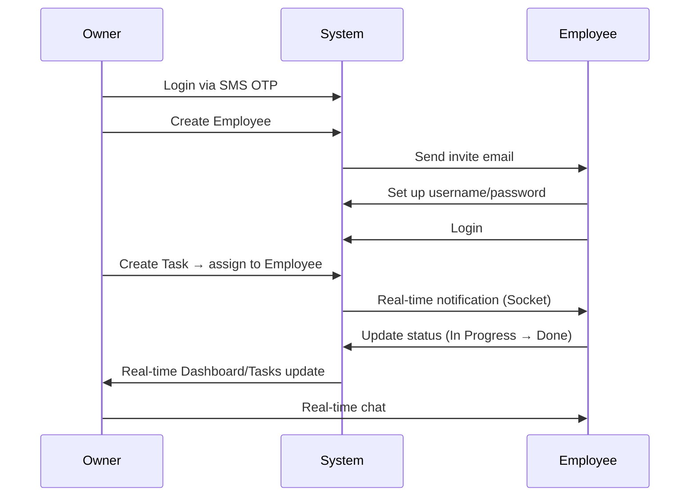

# Feature Report — Skipli Challenge

## 1. Project Overview

This is an **employee and task management** application built for two roles:

- **Owner (Manager):** manage the team, assign tasks, track progress, and chat with employees.
- **Employee:** receive and update task status, edit personal profile, and chat with the manager.

The system consists of a **Backend (Express + TypeScript + Firebase)** and a **Frontend (Next.js 16 + React 19 + Tailwind CSS)**, communicating via REST API and **Socket.io** for real-time updates.

---

## 2. Technology Stack

| Layer | Technologies |
|-------|--------------|
| **Backend** | Express.js, TypeScript, Firebase Firestore, JWT, Socket.io, Joi validation |
| **Third-party integrations** | Twilio (SMS OTP for Owner), SendGrid (Email OTP & invites) |
| **Frontend** | Next.js 16, React 19, TanStack Query, React Hook Form + Zod, TanStack Table |
| **UI/UX** | Tailwind CSS 4, Framer Motion, Lucide icons, react-hot-toast |
| **Security** | Helmet, CORS, express-rate-limit, bcrypt (employee passwords) |

---

## 3. System Architecture

```
┌─────────────────┐     REST API + JWT      ┌──────────────────────┐
│   Next.js FE    │ ◄──────────────────────► │  Express Backend     │
│  (Port 3000)    │     Socket.io (realtime) │  (Port 5000)         │
└─────────────────┘                          └──────────┬───────────┘
                                                        │
                                                        ▼
                                              ┌──────────────────────┐
                                              │  Firebase Firestore  │
                                              └──────────────────────┘
```

The frontend follows a **module-based architecture** (`auth`, `owner`, `employee`, `shared`), with clear separation of pages, hooks, components, and API models.

---

## 4. Features by Role

### 4.1. Owner (Manager)

#### Login (SMS OTP)
- Enter phone number → receive a 6-digit OTP via **Twilio SMS**.
- Verify OTP → receive a **JWT token** (role: `owner`).
- Two-step UI with resend countdown, OTP paste support, and auto-focus.

#### Dashboard
- Statistics: total employees, total tasks, pending tasks, completed tasks.
- **Recent Tasks** and **Recent Employees** lists (latest 5 items).
- Stagger animations with Framer Motion and skeleton loading states.

#### Employee Management (CRUD)
- **Add employee:** name, email, department, phone, role, work schedule.
- Automatically sends an **invite email** (SendGrid) with an account setup link.
- **Edit / Delete** employees (with delete confirmation modal).
- **Search** by name, email, or department (300ms debounce).
- **Server-side pagination**.
- **View details:** modal showing profile and assigned tasks.

#### Task Management (CRUD)
- **Create task:** title, description, assign to employee, due date, priority (low/medium/high).
- **Edit / Delete** tasks.
- **Filter** by status: All, Pending, In Progress, Done.
- **Pagination** and data table (TanStack Table).
- **Real-time sync:** when an employee updates a task, the owner sees it immediately via Socket.io.

#### Real-time Chat
- Sidebar listing active employees.
- 1-on-1 chat with each employee (room based on `ownerPhone + employeeId`).
- Send/receive messages in real time, **typing indicator**, message history from Firestore.
- Enter to send, Shift+Enter for new line.

---

### 4.2. Employee

#### Onboarding — Account Setup
- Receive invite email with link `/setup-account?token=...`.
- Verify invite token → display employee information.
- Create **username + password** (bcrypt hash), set `isSetup = true`.

#### Login (2 methods)
1. **Email OTP:** email → OTP via SendGrid → JWT (role: `employee`).
2. **Username/Password:** login after account setup is complete.

#### Personal Task Management
- View assigned tasks (own tasks only).
- **Update status:** Pending → In Progress → Done (and revert to Pending).
- Filter by status with pagination.
- **Real-time sync** when the owner creates/updates/deletes tasks.

#### Personal Profile
- View and edit: name, email, phone.
- Department and role are read-only (managed by the manager).
- Account status badge (Active / Pending Setup).

#### Chat with Manager
- Chat UI similar to the owner side, connected to the same Socket.io room.

---

## 5. Backend API

### Authentication

| Endpoint | Description |
|----------|-------------|
| `POST /owner/auth/create-code` | Send SMS OTP to owner |
| `POST /owner/auth/validate-code` | Verify OTP → JWT |
| `POST /employee/auth/login-email` | Send email OTP to employee |
| `POST /employee/auth/validate-code` | Verify OTP → JWT |
| `POST /employee/auth/setup-account` | Set up username/password |
| `GET /employee/auth/verify-invite/:token` | Verify invite link |
| `POST /employee/auth/login-username` | Login with username/password |

### Employee Management (Owner only)

| Endpoint | Description |
|----------|-------------|
| `GET /employees` | List employees (search, pagination) |
| `GET /employees/:id` | Employee details |
| `POST /employees` | Create employee + send invite email |
| `PUT /employees/:id` | Update employee |
| `DELETE /employees/:id` | Delete employee |
| `GET /employees/:id/tasks` | Employee's tasks |

### Task Management

| Endpoint | Role | Description |
|----------|------|-------------|
| `GET /tasks` | Owner | All tasks |
| `GET /tasks/my` | Employee | Own tasks |
| `POST /tasks` | Owner | Create task |
| `PUT /tasks/:id` | Owner | Update task |
| `DELETE /tasks/:id` | Owner | Delete task |
| `PATCH /tasks/:id/in-progress` | Employee | Mark as in progress |
| `PATCH /tasks/:id/done` | Employee | Mark as done |
| `PATCH /tasks/:id/pending` | Employee | Revert to pending |

### Chat

| Endpoint | Description |
|----------|-------------|
| `GET /chat/:roomId/messages` | Message history |

### Spec Routes (challenge requirements)
- `/spec/owner/CreateNewAccessCode`, `ValidateAccessCode`, `GetEmployee`, `CreateEmployee`, `DeleteEmployee`
- `/spec/employee/LoginEmail`, `ValidateAccessCode`

---

## 6. Real-time (Socket.io)

### Task sync
- Owner joins room `owner_tasks`; employee joins `employee_{employeeId}`.
- `task_updated` event on create/update/delete — frontend invalidates React Query cache.

### Chat
- Events: `join_room`, `send_message`, `receive_message`, `typing_start/stop`, `user_joined/left`.
- Messages are persisted to Firestore before broadcasting.

---

## 7. Security & Authorization

- **JWT middleware** (`authenticateToken`) on all protected routes.
- **Role-based access:** `requireOwner` / `requireEmployee`.
- Frontend **route guards** in layouts (redirect if not logged in or wrong role).
- Passwords hashed with **bcrypt**; sensitive fields (passwordHash, inviteToken, accessCode) are never returned to the client.
- **Rate limiting**, Helmet headers, CORS configured via `FRONTEND_URL`.
- OTP expiration; dev bypass code `123456` when `NODE_ENV !== production`.

---

## 8. UX/UI

- Consistent design system: Button, Card, Modal, Badge, Avatar, Table, Pagination, Skeleton, EmptyState.
- Form validation with **React Hook Form + Zod** (client) and **Joi** (server).
- Toast feedback for all user actions.
- Responsive layout with sidebar navigation.
- Loading states (skeleton, spinner) and guided empty states.
- Dark theme with brand colors.

---

## 9. Testing

Basic backend unit tests:
- `app.test.ts` — API health check
- `email.test.ts` — SendGrid integration
- `sms.test.ts` — Twilio integration

---

## 10. Core Business Flow



---

## 11. Technical Highlights (for interview presentation)

1. **Clear separation** of frontend/backend, module-based structure, reusable shared hooks/components.
2. **Dual auth flows** (SMS vs Email OTP) + employee onboarding via invite link.
3. **Real-time** task and chat updates without page refresh.
4. **Server-side pagination & search** with Firestore.
5. **Two-layer validation** (Zod + Joi), unified error handling (`AppError`, `handleControllerError`).
6. **End-to-end type safety** with TypeScript.
7. **Challenge spec compliance** via `/spec/*` routes alongside an extended REST API.
